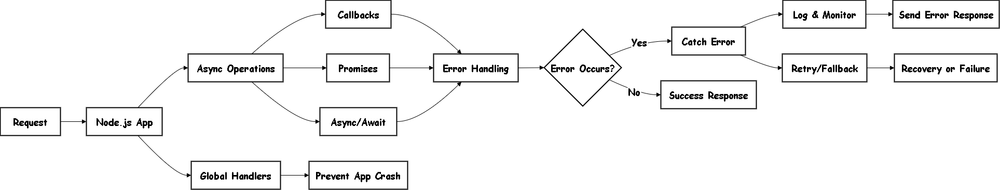
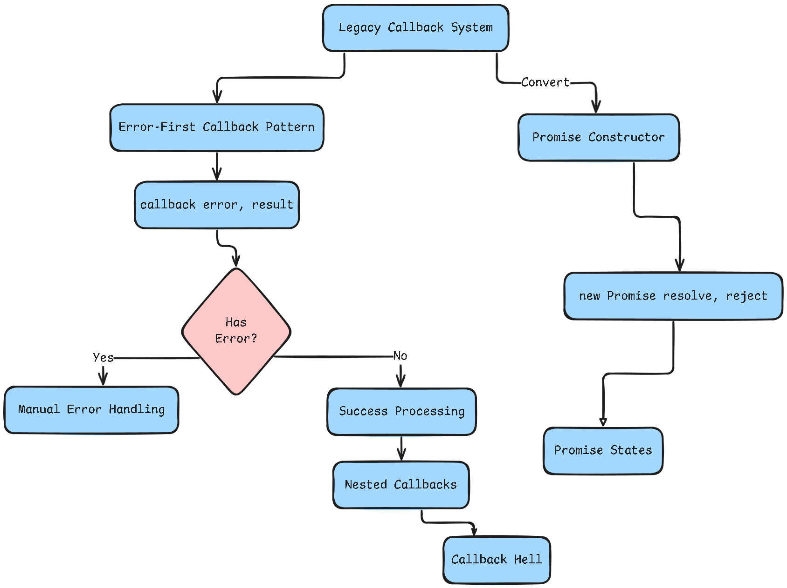

# Lab 3: Asynchronous Programming in Node.js

## Introduction

Node.js uses **asynchronous programming** to handle multiple operations efficiently without blocking the main thread. This means your application can start one operation (like reading a file) and continue doing other work while waiting for it to complete.

### What is Asynchronous Programming?

**Synchronous (blocking)**: Code executes line by line. Each operation must finish before the next one starts.

**Asynchronous (non-blocking)**: Code can start an operation and continue with other tasks while waiting for the first operation to complete.

### Why Use Asynchronous Programming?

Consider this cooking example:
- **Synchronous**: Wait for water to boil (10 min) → chop vegetables (5 min) → prepare sauce (8 min) = 23 minutes total
- **Asynchronous**: Start boiling water → chop vegetables while water heats → prepare sauce = 10 minutes total

Node.js provides three main ways to handle asynchronous operations:

### 1. Callbacks
Functions passed as arguments to be executed when an operation completes.



```js
// Reading a file with callback
fs.readFile('file.txt', 'utf8', (err, data) => {
    if (err) throw err;
    console.log(data);
});
```

### 2. Promises
Objects that represent the eventual completion (or failure) of an asynchronous operation.

```js
// Reading a file with Promise
fs.promises.readFile('file.txt', 'utf8')
    .then(data => console.log(data))
    .catch(err => console.error(err));
```

### 3. Async/Await
Modern syntax that makes asynchronous code look and behave more like synchronous code.

```js
// Reading a file with async/await
async function readFile() {
    try {
        const data = await fs.promises.readFile('file.txt', 'utf8');
        console.log(data);
    } catch (err) {
        console.error(err);
    }
}
```

### The Event Loop

The event loop is Node.js's mechanism for handling asynchronous operations. It continuously checks for pending operations and executes their callbacks when ready.

#### Node.js Architecture Overview

<div align="center">
  
</div>

*Complete Node.js Event Loop and Asynchronous Architecture - Visual representation of how Node.js handles async operations*

## Learning Objectives

After completing this lab, you will understand:

### Basic Concepts
- The difference between synchronous and asynchronous code
- How callbacks, promises, and async/await work
- When to use each asynchronous pattern

### Practical Skills
- Converting callback-based code to promises and async/await
- Handling errors in asynchronous operations
- Building a simple task queue system
- Understanding how the Node.js event loop works

### Best Practices
- Writing clean, readable asynchronous code
- Proper error handling strategies
- Performance optimization with concurrent operations

## Lab Structure

This lab contains 5 practical tasks that build upon each other:

### Task 1: Callback to Promise Conversion
Learn how to convert old callback-style code to modern Promise-based code.

### Task 2: Async/Await Implementation
Use the modern async/await syntax for cleaner, more readable code.

### Task 3: Build a Task Queue
Create a system that processes multiple asynchronous operations in order.

### Task 4: Error Handling
Implement proper error handling for asynchronous operations.

### Task 5: Event Loop Understanding
See how Node.js executes different types of code in the correct order.

## Setup Instructions

### Prerequisites
- Node.js v14 or higher installed on your system

### Getting Started
1. Check your Node.js version:
```bash
node -v
```

2. Run the main lab file:
```bash
node lab3.js
```

3. Or use npm to run:
```bash
npm start
```

## Task Details

### Task 1: Callback to Promise Conversion

**Goal**: Convert callback-based file operations to Promise-based implementations.

**What you'll learn**:
- How to wrap callback functions with Promises
- The difference between callback and Promise error handling
- Why Promises are easier to work with

#### Architecture Comparison



**Before (Callback)**:
```js
fs.readFile('file.txt', 'utf8', (err, data) => {
    if (err) {
        console.error('Error:', err);
        return;
    }
    console.log('File content:', data);
});
```

**After (Promise)**:
```js
function readFilePromise(filename) {
    return new Promise((resolve, reject) => {
        fs.readFile(filename, 'utf8', (err, data) => {
            if (err) reject(err);
            else resolve(data);
        });
    });
}

readFilePromise('file.txt')
    .then(data => console.log('File content:', data))
    .catch(err => console.error('Error:', err));
```

### Task 2: Async/Await Implementation

**Goal**: Use async/await for cleaner asynchronous code.

**What you'll learn**:
- How async/await makes code more readable
- Proper error handling with try-catch
- The relationship between async functions and Promises

**Implementation**:
```js
async function readFileAsync(filename) {
    try {
        const data = await fs.promises.readFile(filename, 'utf8');
        console.log('File content:', data);
        return data;
    } catch (error) {
        console.error('Error:', error);
        throw error;
    }
}
```

### Task 3: Build a Task Queue

**Goal**: Create a system that processes asynchronous tasks in order.

**What you'll learn**:
- How to manage multiple async operations
- Sequential vs parallel execution
- Building reusable async utilities

#### Task Queue Architecture

```
Task Queue Flow:

Add Task 1 ──┐
Add Task 2 ──┼──► [Queue: Task1, Task2, Task3] ──► Processor ──► Execute One by One
Add Task 3 ──┘                                        │
                                                       ▼
                                              [Running: false/true]
```

**Basic Implementation**:
```js
class TaskQueue {
    constructor() {
        this.tasks = [];
        this.running = false;
    }

    add(task) {
        return new Promise((resolve, reject) => {
            this.tasks.push({ task, resolve, reject });
            if (!this.running) this.process();
        });
    }

    async process() {
        this.running = true;
        while (this.tasks.length > 0) {
            const { task, resolve, reject } = this.tasks.shift();
            try {
                const result = await task();
                resolve(result);
            } catch (error) {
                reject(error);
            }
        }
        this.running = false;
    }
}
```

### Task 4: Error Handling

**Goal**: Implement proper error handling for async operations.

**What you'll learn**:
- Different ways to handle async errors
- Error propagation in async code
- Recovery strategies

**Implementation**:
```js
async function handleErrors() {
    try {
        const result = await riskyOperation();
        console.log('Success:', result);
    } catch (error) {
        console.error('Caught error:', error.message);
        // Handle error appropriately
    }
}
```

### Task 5: Event Loop Understanding

**Goal**: See how Node.js executes different types of code.

**What you'll learn**:
- Execution order of sync vs async code
- How the event loop prioritizes operations
- Timing of different async patterns

#### Event Loop Priority Order

```
Priority (Highest to Lowest):
1. Call Stack (Synchronous code)
2. process.nextTick() callbacks
3. Microtasks (Promises, queueMicrotask)
4. Timer callbacks (setTimeout, setInterval)
5. I/O callbacks (file reads, network)
6. Check callbacks (setImmediate)
7. Close callbacks (socket closures)
```


**Example**:
```js
console.log('1. Synchronous start');

setTimeout(() => console.log('4. Timeout'), 0);
Promise.resolve().then(() => console.log('3. Promise'));
setImmediate(() => console.log('5. Immediate'));

console.log('2. Synchronous end');

// Output:
// 1. Synchronous start
// 2. Synchronous end  
// 3. Promise
// 5. Immediate
// 4. Timeout
```

## Additional Files

### test.js
Contains tests for individual components and demonstrates advanced patterns:
- Promise chaining
- Parallel vs sequential execution
- Error propagation
- Task queue testing

### examples.js
Shows practical examples and best practices:
- Callback hell vs clean async/await
- Concurrent file processing
- Retry mechanisms
- Timeout handling

### event-loop-deep-dive.js
Detailed exploration of the Node.js event loop:
- All event loop phases
- Microtask vs callback queue priority
- Non-blocking patterns
- Common pitfalls to avoid

## Running the Lab

### Individual Files
```bash
# Main lab
node lab3.js

# Component tests
node test.js

# Practical examples
node examples.js

# Event loop deep dive
node event-loop-deep-dive.js
```

### Using npm scripts
```bash
# Main lab
npm start

# All tests
npm test

# Examples
npm run examples

# Event loop demo
npm run event-loop

# Run everything
npm run all
```

## Best Practices

### Error Handling
- Always use try-catch with async/await
- Handle Promise rejections with .catch()
- Never ignore errors - at minimum, log them
- Re-throw errors when appropriate for error propagation

### Avoid Common Mistakes
- Don't nest callbacks (callback hell)
- Don't block the event loop with long-running operations
- Don't mix Promise patterns (stick to one approach)
- Always await async functions

### Performance Tips
- Use Promise.all() for concurrent independent operations
- Avoid sequential awaits when operations can run in parallel
- Understand how the event loop affects execution order
- Choose the right async pattern for your use case

### Code Organization
- Use clear function names that indicate async behavior
- Separate async logic into focused functions
- Document async behavior in comments
- Test both success and error scenarios

## Learning Path

### Beginner (Start Here)
1. Run `lab3.js` to see all concepts in action
2. Focus on Tasks 1, 2, and 5 first
3. Understand the basics of callbacks, promises, and async/await
4. Learn how the event loop affects execution order

### Intermediate
1. Complete Tasks 3 and 4
2. Run `test.js` to see advanced patterns
3. Practice building your own async utilities
4. Master error handling strategies

### Advanced
1. Study `examples.js` for real-world patterns
2. Explore `event-loop-deep-dive.js` for deep understanding
3. Learn performance optimization techniques
4. Build production-ready async applications

## File Structure

```
lab3/
├── lab3.js                    # Main lab with 5 tasks
├── test.js                    # Component tests
├── examples.js                # Practical examples
├── event-loop-deep-dive.js    # Event loop exploration
├── input.txt                  # Test file for reading
├── package.json               # Project configuration
└── README.md                  # This documentation
```

## References

### Documentation
- [Node.js fs module](https://nodejs.org/api/fs.html)
- [MDN: Promises](https://developer.mozilla.org/en-US/docs/Web/JavaScript/Reference/Global_Objects/Promise)
- [Node.js Event Loop](https://nodejs.dev/en/learn/understanding-the-nodejs-event-loop/)
- [MDN: Async/Await](https://developer.mozilla.org/en/docs/Learn/JavaScript/Asynchronous/Promises)

### Additional Learning
- "What the heck is the event loop anyway?" - Philip Roberts (JSConf)
- [Node.js Best Practices](https://github.com/goldbergyoni/nodebestpractices)
- [JavaScript Promises: An Introduction](https://web.dev/promises/)

---

**Ready to start?** Run `node lab3.js` to begin your asynchronous programming journey!

